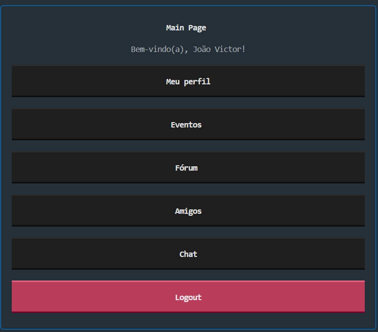
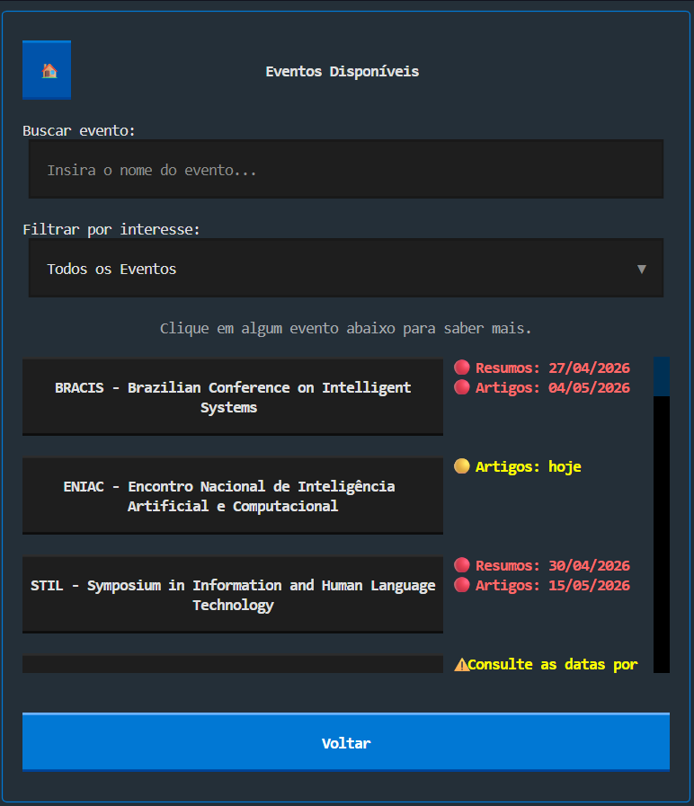

# Conecta++ Release 1.0 🚀

O **Conecta++** é uma aplicação de interface de terminal (TUI) desenvolvida como projeto prático para o curso de **Sistemas de Informação** da **UFRPE**. A plataforma visa conectar a comunidade acadêmica a eventos, permitindo a gestão de perfis e a personalização de experiências com base em interesses específicos.

## 🖼️ Visualização da Tela de Eventos

Abaixo estão algumas capturas da tela responsável por listar os eventos disponíveis no sistema.  
Nessa interface, o usuário pode filtrar os eventos por interesse, visualizar a lista de eventos cadastrados e acessar mais detalhes clicando em uma opção.

<div align="center">

<table>
  <tr>
    <td align="center">
      
      <br>
      <strong>Filtro de eventos por interesse</strong>
    </td>
    <td align="center">
      
      <br>
      <strong>Lista de eventos disponíveis</strong>
    </td>
  </tr>
</table>

</div>

### 📌 Funcionalidade exibida

A tela apresenta uma vitrine de eventos cadastrados no sistema, permitindo que o usuário visualize conferências, simpósios e encontros relacionados aos seus interesses.

Entre os elementos exibidos estão:

- Filtro por área de interesse;
- Lista de eventos disponíveis;
- Cards individuais para cada evento;
- Barra de rolagem para navegação;
- Botão de retorno para a tela anterior.

Essa funcionalidade faz parte da proposta principal do projeto, que é facilitar a descoberta de eventos acadêmicos e tecnológicos de forma simples, organizada e interativa.

---

## Bibliotecas usadas

### Bibliotecas externas

| Biblioteca | Objetivo no projeto |
|---|---|
| `textual` | Criar a interface gráfica em terminal, com telas, botões, inputs, labels e navegação entre páginas. |
| `python-dotenv` | Carregar variáveis de ambiente do arquivo `.env`, como e-mail e senha de app. |
| `unidecode` | Remover acentos de textos usados em identificadores de componentes da interface. |

### Bibliotecas nativas do Python

| Biblioteca | Objetivo no projeto |
|---|---|
| `sqlite3` | Criar e manipular o banco de dados local SQLite. |
| `hashlib` | Gerar hash seguro de senhas e códigos. |
| `hmac` | Comparar hashes de forma mais segura. |
| `secrets` | Gerar salt aleatório para aumentar a segurança das senhas. |
| `smtplib` | Enviar e-mails usando servidor SMTP. |
| `email.message` | Montar a mensagem de e-mail enviada ao usuário. |
| `datetime` | Controlar data e hora de expiração dos códigos de verificação. |
| `random` | Gerar códigos numéricos aleatórios. |
| `re` | Validar campos como nome, e-mail, data e hora. |
| `os` | Ler variáveis de ambiente configuradas no sistema ou arquivo `.env`. |

## ⚙️ Funcionalidades elaboradas e seus objetivos

### ✅ Funcionalidades entregues na versão 1.0
As funcionalidades do **Conecta++** foram organizadas para oferecer uma experiência completa ao usuário, desde o cadastro até a visualização e gerenciamento de eventos personalizados por interesse.

---

### 🔐 Autenticação e segurança

| Funcionalidade | Descrição | Objetivo |
|---|---|---|
| **Cadastro de usuário** | Permite que novos usuários criem uma conta informando nome, e-mail e senha. | Registrar usuários no sistema de forma organizada e segura. |
| **Validação de dados** | Valida nome, e-mail, senha e confirmação de senha durante o cadastro. | Evitar dados inválidos, incompletos ou inconsistentes no banco de dados. |
| **Verificação de e-mail por código** | Envia um código para o e-mail informado antes de finalizar o cadastro. | Confirmar que o e-mail realmente pertence ao usuário. |
| **Login de usuário** | Permite o acesso ao sistema usando e-mail e senha cadastrados. | Garantir que apenas usuários autenticados acessem as telas internas. |
| **Recuperação de senha** | Envia um código por e-mail para permitir a criação de uma nova senha. | Recuperar o acesso à conta caso o usuário esqueça a senha. |
| **Criptografia de senhas** | Armazena as senhas usando hash com `PBKDF2-HMAC-SHA256` e salt aleatório. | Proteger as credenciais dos usuários e evitar o armazenamento de senhas em texto puro. |
| **Mostrar e ocultar senha** | Adiciona um botão para alternar a visibilidade dos campos de senha. | Melhorar a usabilidade nas telas de login, cadastro e alteração de senha. |

---

### 👤 Gerenciamento de perfil

| Funcionalidade | Descrição | Objetivo |
|---|---|---|
| **Atualização de nome** | Permite que o usuário altere o nome exibido no perfil. | Manter os dados do usuário atualizados. |
| **Alteração de senha** | Permite trocar a senha informando a senha atual e uma nova senha válida. | Oferecer uma forma segura de atualizar as credenciais da conta. |
| **Exclusão de conta** | Permite que o usuário remova sua conta do sistema. | Dar ao usuário controle sobre seus próprios dados dentro da aplicação. |

---

### ⭐ Interesses e personalização

| Funcionalidade | Descrição | Objetivo |
|---|---|---|
| **Seleção de interesses** | Permite que o usuário escolha áreas de interesse após o cadastro. | Personalizar a experiência e direcionar eventos mais relevantes para cada usuário. |
| **Listagem de eventos por interesse** | Exibe eventos relacionados aos interesses cadastrados pelo usuário. | Tornar a navegação mais útil e alinhada ao perfil do usuário. |
| **Filtro de eventos** | Permite filtrar eventos por uma área de interesse específica. | Facilitar a busca por eventos dentro da aplicação. |

---

### 📅 Eventos

| Funcionalidade | Descrição | Objetivo |
|---|---|---|
| **Cadastro de eventos** | Permite criar eventos com nome, descrição, local, data, hora, criador e interesses relacionados. | Armazenar eventos no banco de dados e associá-los às áreas de interesse. |
| **Detalhes do evento** | Exibe informações completas de um evento selecionado. | Permitir que o usuário consulte descrição, local, data, hora e criador antes de favoritar. |
| **Favoritar e desfavoritar eventos** | Permite adicionar ou remover eventos da lista de favoritos. | Salvar eventos importantes para consulta posterior. |
| **Listagem de eventos favoritos** | Exibe todos os eventos marcados como favoritos pelo usuário. | Organizar em uma tela própria os eventos que o usuário deseja acompanhar. |

---


## 🛠️ Tecnologias Utilizadas

*   **Linguagem**: Python 3.14
*   **Interface**: [Textual](https://textual.textualize.io/) (TUI Framework)
*   **Banco de Dados**: SQLite3
*   **Segurança**: PBKDF2-HMAC com SHA-256 para hashing de senhas e `hmac.compare_digest` contra ataques de timing.
*   **Comunicação**: Protocolo SMTP para envio de e-mails de verificação.

---

## 📂 Estrutura do Projeto

O código está organizado para facilitar a manutenção e escalabilidade:

| Diretório/Arquivo | Descrição |
| :--- | :--- |
| `main.py` | Ponto de entrada que inicializa a aplicação. |
| `screens/` | Contém as classes de visualização (views) da interface. |
| `services/` | Lógica de negócio: autenticação, eventos, banco de dados e validações. |
| `conecta++.db` | Arquivo do banco de dados relacional. |
| `.env` | Variáveis de ambiente sensíveis (credenciais de e-mail). |

---

## 🚀 Como Executar

### Pré-requisitos
*   Python 3.14 ou superior.
*   Conta Gmail com "Senha de App" configurada.

### Instalação

1.  **Clone o repositório**:
    ```bash
    git clone https://github.com/joaovictornqm/conecta-mais-mais.git
    ```

2.  **Instale as dependências**:
    ```bash
    pip install textual unidecode python-dotenv
    ```

3.  **Configure o ambiente**:
    Crie um arquivo `.env` na raiz do projeto:
    ```env
    APP_EMAIL=seu-email@gmail.com
    APP_EMAIL_PASSWORD=sua-senha-de-app
    ```

4.  **Inicie a aplicação**:
    ```bash
    python main.py
    ```

---

## 🎓 Contexto Acadêmico

Este projeto integra as atividades da disciplina **PISI I (Projeto Interdisciplinar para Sistemas de Informação I)** na **UFRPE**. O desenvolvimento focou na aplicação de conceitos de Engenharia de Software, persistência de dados e segurança da informação.

**Desenvolvedores:** João Victor Macêdo e Wellison Cavalcante  
**Instituição:** Universidade Federal Rural de Pernambuco (UFRPE)  
**Curso:** Bacharelado em Sistemas de Informação  

## 📊 Planilha de Features

A documentação das funcionalidades do projeto também está organizada em uma planilha, contendo as features planejadas, fluxos principais, fluxos alternativos, fluxos de erro e status de desenvolvimento.

🔗 **Acesse a planilha de features aqui:**  
[Planilha de Features do Projeto](https://docs.google.com/spreadsheets/d/19YSUOH3TCYiOljYli4W6_OuNz7OMyL29pgIxmgoxNoU/edit?gid=0#gid=0)
